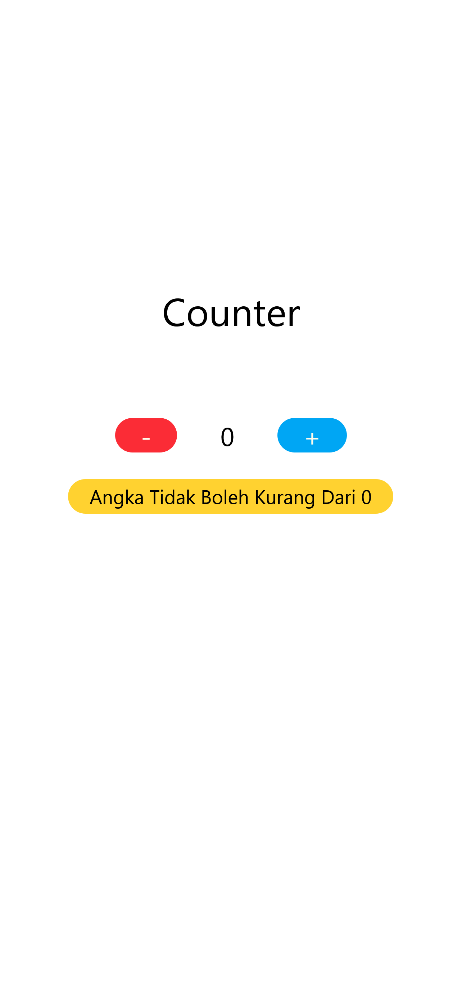
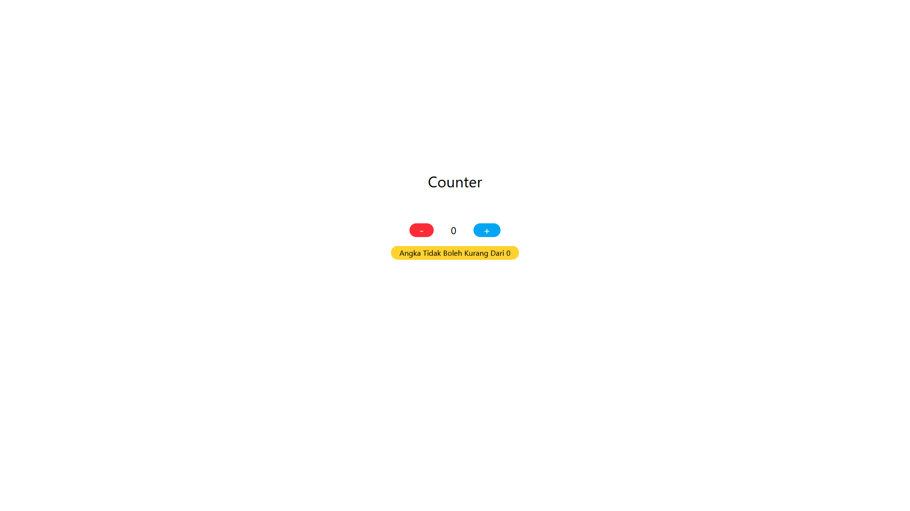

# Simple Project Counter App Tailwind + React + Vite

<p align="start">
  This project is a simple demonstration of how to use <code>useState</code> in React. 
  <br />
  <strong>useState</strong> is a Hook that allows you to add state to functional components in React. 
  It returns an array with two elements: the current state value and a function to update that state.
  <br />
  In this project, we use <code>useState</code> to manage a counter value, and by clicking buttons, we increase or decrease the value, which updates the UI accordingly.
</p>

---

<h2 align="center">Mobile Mode </h2>
<div align="center">
  
</div>

---

<h2 align="center">PC Mode </h2>
<div align="center">
  
</div>

---

## How to install project :

### 1. Clone Project

```bash
    git clone https://github.com/Maniexie/Counter-App-03feb-react.git
```

### 2. Install Dependencies & Run Project

```bash
    npm install && npm run dev
```

### 3. Happy Use , don't forget Star for Project 🚀🚀

```bash
    Wish You All the best 🙏
```
